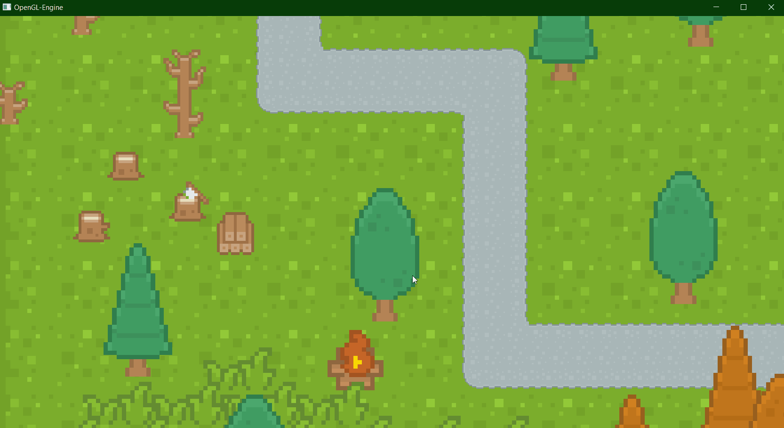

# OpenGL-Engine

This project is my introduction to graphics engine design. The plan is to first implement a working 2D engine on Windows using OpenGL, then moving on to making a full 3D PBR renderer and scripting language support, then eventually adding support for Vulkan, DirectX, perhaps other graphics APIs.

# Current project state
The engine currently has working 2D rendering functionality using an dynamic orthographic/perspective cameras. The latest updates have added basic GUI support to allow for real-time adding/removing of entities from the active scene.   

# Next steps 
- Adding a proper 3D (non-quad meshes) rendering implementation to the engine
- Physically Based Rendering (PBR) support
- Adding a scripting language
- Animation support
- Audio systems

# Basic demos 
Transformed, textured quads

Single texture atlas/spritesheet 

